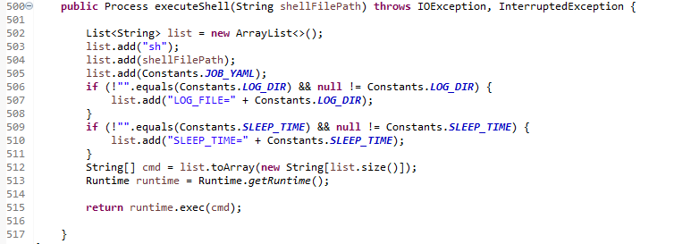
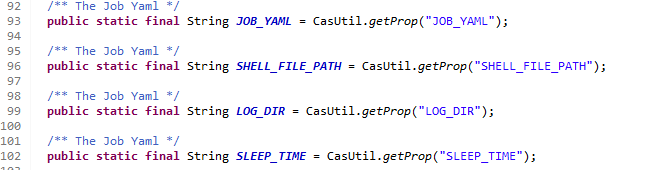

##Steps to migrate to EKS environment

Step 1: Import the test project and the RapidTestBoot Project to be
migrated

Step 2: Open the pom.xml of the RapidTestBoot project and change the RTF
version to the latest.

Currently it is 2.12. Also add the below dependency in the dependencies
tag

\<!\-- https://mvnrepository.com/artifact/com.amazonaws/aws-java-sdk-sts
\--\>

\<dependency\>

\<groupId\>com.amazonaws\</groupId\>

\<artifactId\>aws-java-sdk-sts\</artifactId\>

\<version\>1.12.115\</version\>

\</dependency\>

Step 3: If there is any change in the RTF version, then change the
version of RTF in the banner.txt in src/main/resources

Step 4: Open the pom.xml of the test project and change the RTF version
to the latest.

Step 5: Open the Test script class and call the **executeShell(String
shellFilePath)** method where the

Shell script needs to be executed.

a.  The argument to this method is the shell file path, which is
    provided in the Element Repository file.

b.  The job yaml file path is provided in the element Element Repository
    file.

c.  The log directory can be provided if required and the key for log
    directory is "LOG_FILE=" followed by the value.

d.  The sleep time can be provided if required and the key for sleep
    time is "SLEEP_TIME=" followed by the value.

> {width="6.268055555555556in"
> height="2.2694444444444444in"}

Step 6: Add the properties required for execute shell to read the
properties from element repository

in the constants file.

{width="5.807786526684165in"
height="1.5095352143482064in"}

Step 7: Update the config.yml file in .circleci as in the rtf blank
project

Step 8: Also update the Dockerfile as in the rtf blank project

Step 9: Update the rapidTestConfig.properties

\- Modify RTF db configuration sections in the below format.

> spring.rtf.url=jdbc:postgresql://\${RTF_POSTGRES_HOST:localhost}:\${RTF_POSTGRES
>
> \_PORT:5433}/\${RTF_POSTGRES_DATABASE:postgres}

spring.rtf.username=\${RTF_POSTGRES_USER:users}

spring.rtf.password=\${RTF_POSTGRES_PASSWORD:password}

spring.rtf.platform=postgresql

Step 10: Create a job.yml

\- Should create a job.yml for the RTF job about to run. A sample is
given.

\- Replace blank project contents mentioned below with that of your
project in job.yml.

metadata.name

metadata.labels.app

spec.template.metadata.labels.app

spec.template.spec.containers.name

spec.template.spec.containers.image

\- Add the environment variables required for your project after line 59
in job.yml in the same format of above variables.

\- NOTE: DO NOT MAKE ANY CHANGES TO THE ENVIRONMENT VARIABLES ON OR
ABOVE LINE 59.
