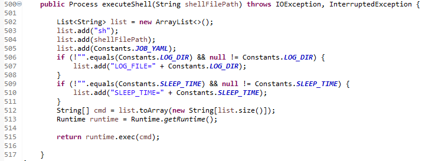
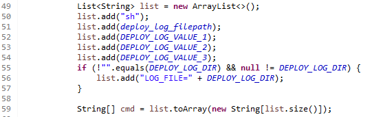
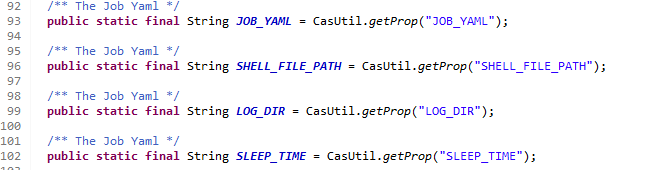

# Steps to migrate to EKS environment

This Article explains the steps for migrating the test project to EKS environment.

* [Step 1: Job Yaml Execution](#job-yaml-Execution-head)

* [Step 1: Job Yaml Execution](#steps-jobyaml-execution)

* [Step 2: Deploy Logs](#deploy-logs)

* [Step 3: Add the properties](#add-properties-elementrepo)

* [Step 4: Update config.yml](#update-config.yml)

* [Step 5: Update the docker file](#update-docker-file)

* [Step 6: Update the rapidTestConfig.properties](#update-rapidTestConfig-properties)

* [Step 7: Create a job.yml](#create-job.yml)

## Step 1: Job Yaml Execution 
For executing Job Execution, there are two mandatory arguments and two non-mandatory arguments.

* The first argument to this job execution shell is the shell file path, which is provided in the Element Repository file.
	
* The second argument is the job yaml file path which is provided in the element Element Repository file.

* The log directory can be provided if required and the key for log directory is "LOG_FILE=" followed by the value.

* The sleep time can be provided if required and the key for sleep time is "SLEEP_TIME=" followed by the value.

* 

## Step 2: Deploy Logs 
For executing the deploy log shell, there are four mandatory parameters and one non mandatory 
* The first parameter is the deploy log file path

* The second parameter is the second argument to the deploy log shell.

* The third parameter is the third argument to the deploy log shell.

* The fourth parameter is the fourth argument to the deploy log shell.

* The last parameter is optional and the key for log directory is "LOG_FILE=" followed by the value.

* 

## Step 3: Add the properties 
Add the properties required for execute shell to read the
properties from element repository in the constants file.

## Step 4: Update config.yml 
Update the config.yml file in .circleci as in the rtf-blankproject-eks -> develop branch

## Step 5: Update the docker file 
Also update the Dockerfile as in the rtf-blankproject-eks -> develop branch

## Step 6: Update the rapidTestConfig.properties 

* Modify RTF db configuration sections in the below format.

	spring.rtf.url=jdbc:postgresql://\${RTF_POSTGRES_HOST:localhost}:\${RTF_POSTGRES_PORT:5433}/\${RTF_POSTGRES_DATABASE:postgres}

	spring.rtf.username=\${RTF_POSTGRES_USER:users}

	spring.rtf.password=\${RTF_POSTGRES_PASSWORD:password}

	spring.rtf.platform=postgresql

## Step 7: Create a job.yml 

Should create a job.yml for the RTF job about to run. A sample is
given.

Replace blank project contents mentioned below with that of your
project in job.yml.

metadata.name

metadata.labels.app

spec.template.metadata.labels.app

spec.template.spec.containers.name

spec.template.spec.containers.image

Add the environment variables required for your project after line 59
in job.yml in the same format of above variables.

*NOTE: DO NOT MAKE ANY CHANGES TO THE ENVIRONMENT VARIABLES ON OR
ABOVE LINE 59.*
